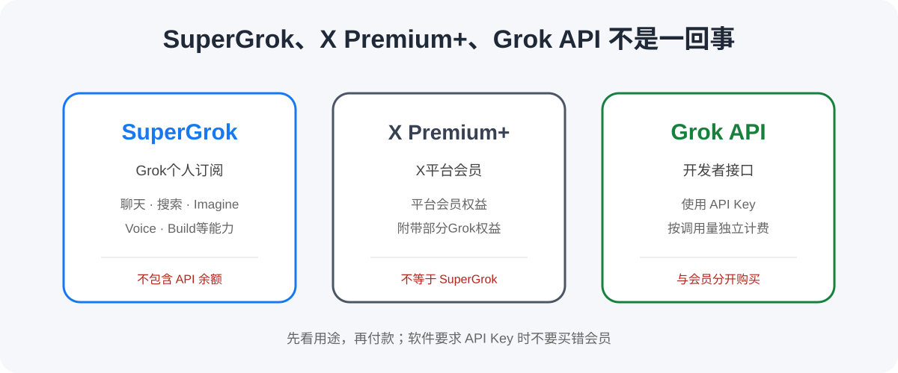
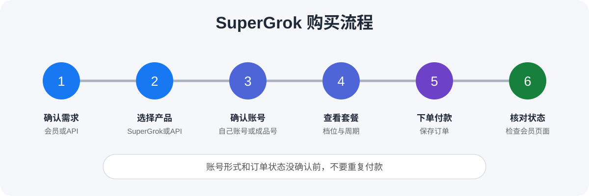

# [2026最新] Grok国内购买与SuperGrok充值教程：SuperGrok、X Premium+、API怎么选？

> 最后核实日期：2026-08-12

国内想用 Grok，最容易搞错的不是注册，而是到底该买什么。SuperGrok、X Premium+、Grok API 看起来都和 Grok 有关，实际不是一回事。只是想在 Grok 里聊天、搜索、用 Imagine、Voice 或 Build 等 AI 能力，通常先看 SuperGrok；软件如果明确要求 API Key，就该看 API。能完成官方付款，直接订最省心。付款不方便，再比较自己账号代充和成品账号。

如果已经确认需要 SuperGrok，又不想折腾海外支付，可以通过星际放映厅给自己的 Grok 账号升级 SuperGrok。具体套餐、时长和办理资料以下单页面为准。

  

## SuperGrok是什么

SuperGrok 是 xAI 面向个人用户的 Grok 付费订阅。相比免费版，它提供更高的使用额度，并包含 Grok 4.5。当前官方个人套餐页显示，SuperGrok 为 30 美元/月；税费、地区、移动端渠道和后续调整都可能让最终价格不同。

现在的付费用量采用共享的周额度机制，不宜再按旧资料写成固定“每天多少次”。不同模型、搜索、图片或视频能力可能消耗不同，用量状态以账户页面为准。

如果你只是想正常高频使用 Grok，又不需要最高强度，普通 SuperGrok 通常是更自然的起点。

## SuperGrok和SuperGrok Plus怎么选

| 套餐 | 适合谁 | 主要区别 | 需要注意 |
|---|---|---|---|
| Free | 偶尔体验的人 | 无需付费 | 额度和功能较少 |
| SuperGrok | 正常高频使用的人 | 30美元/月，额度高于免费版 | 周额度按功能共享 |
| SuperGrok Plus | 重度使用、视频生成较多的人 | 100美元/月，更高用量和优先访问 | 成本明显更高 |
| SuperGrok Lite | 有特定强度需求的人 | 官方套餐比较中列出的层级 | 价格与权益购买当天核对 |
| SuperGrok Heavy | 有特定强度需求的人 | 官方套餐比较中列出的层级 | 价格与权益购买当天核对 |

普通用户没必要一上来买最高档。经常长时间用 Grok、视频生成多，或者一周内反复碰到额度限制，再比较 SuperGrok Plus 或更高层级。套餐名字高级，不代表你一定用得上。

## SuperGrok和X Premium+有什么区别

很多人看到 Grok 就以为必须买 X Premium+，其实不是一回事。

X Premium 和 Premium+ 是 X 平台的付费会员，会员权益围绕 X 展开，同时附带不同程度的 Grok 使用权限。SuperGrok 则是围绕 Grok 本身的独立订阅。主要为了蓝标、少广告、创作者功能，同时顺便用 Grok，可以看 X Premium；主要为了 Grok 聊天、搜索、Imagine、Voice、Build 等 AI 能力，优先比较 SuperGrok。

X Premium+ 不等于 SuperGrok，两边的价格、模型和额度也可能调整。详细对照见 [SuperGrok与X Premium说明](docs/supergrok-vs-x-premium.md)。

## SuperGrok和Grok API不是一回事

SuperGrok 是普通用户会员，Grok API 是开发者接口。API 需要单独开通，按实际调用量独立计费。买 SuperGrok 不会自动获得 API Key 或 API 余额，也不等于给 API 账户充值。

如果你用的软件明确让你填写 API Key，那你要找的通常是 Grok API，不是 SuperGrok 会员。这种情况别买错了。更多说明见 [SuperGrok与API区别](docs/supergrok-vs-api.md)。

## 给自己的账号升级，还是直接买成品账号？

星际放映厅当前同时提供 SuperGrok 代充和 SuperGrok 成品账号，两种商品不是一回事。

| 方式 | 账号是谁的 | 优点 | 适合谁 |
|---|---|---|---|
| 给自己的账号升级 | 用户自己的 Grok 账号 | 原账号和数据继续使用 | 想长期保留自己账号的人 |
| SuperGrok成品账号 | 平台交付另一个账号 | 到手即可使用，价格可能较低 | 短期使用并接受账号规则的人 |

给自己的账号升级时，用户继续使用原来的 Grok 账号，由平台办理 SuperGrok。具体办理时需要提供什么资料，以下单后的实时办理说明为准。公开页面没有明确写必须使用 Token、Cookie、密码或验证码，本文不会自行猜测。

成品账号要看清账号归属、能否修改资料、找回方式和长期使用规则。价格低一点，不代表更适合保存重要数据。

## 国内有哪些购买方式

- **grok.com 官方订阅：** 能完成官方付款时最省心，账号和续费都由自己管理。
- **移动端应用内购买：** 如果当前 App Store 或 Google Play 账户显示入口，可比较最终价格和退款渠道。
- **X Premium / Premium+：** 适合本来就需要 X 会员权益的人，不要把它直接当成 SuperGrok。
- **第三方给自己的账号升级：** 支付不方便、又想保留原账号时可以比较。
- **SuperGrok成品账号：** 适合接受另一个账号及其使用规则的人。

## 为什么推荐星际放映厅

官网版权信息显示平台自 2023 年起持续运营，并公开展示备案信息。平台有完整的商品、订单、客服和售后系统，不是临时搭建的单页充值页面。

当前既有给自己的 Grok 账号升级 SuperGrok 的服务，也有 SuperGrok 成品账号，用户可以按账号需求选择。公开商品说明显示，账号升级后可使用 Grok 4.5。套餐、价格和服务周期以下单页面实时显示为准。

对没有合适海外支付方式的人来说，通过成熟订单系统办理，比反复尝试支付省事。具体资料、到账时间、续费和售后仍以实时订单说明为准。

  

## 企业采购与国内正规发票

企业、工作室或团队如果有采购、报销或开票需求，建议在付款前联系客服确认当前 SuperGrok 商品是否支持国内正规发票，并确认抬头、开票内容、金额、税点和发送方式。

## 购买流程

1. 确认需要 SuperGrok、X Premium 还是 Grok API。
2. 选择自己账号升级或成品账号。
3. 查看套餐、服务周期和售后范围。
4. 核对下单时需要的资料与提交渠道。
5. 付款后保存订单，状态不明时别重复购买。
6. 开通后回到 Grok 账户页面核对会员状态。

## 常见故障

### 付款失败

先看银行、应用商店或支付渠道的原始提示，核对余额、账单信息和交易能力。短时间反复提交可能带来重复预授权。官方订单找官方支持，第三方订单按订单渠道联系售后。

### 扣款了，但会员没有显示

扣款通知不等于会员已开通，也可能是待处理或预授权。确认登录账号、订单渠道和会员页面；前一笔状态没弄清前不要再付一次。

### 账号出现限制

账号限制和充值不是同一个问题。看清页面提示和官方邮件，先保护邮箱与登录方式，再联系相应支持。不要相信“保证解封”。完整排查见 [故障处理指南](docs/troubleshooting.md)。

## 常见问题FAQ

### 1. 国内可以直接买SuperGrok吗？

官方账户显示订阅入口、付款方式也能通过，就可以直接买。官方订阅最方便管理续费；支付卡住时再考虑第三方。

### 2. SuperGrok现在多少钱？

当前官方个人页显示 SuperGrok 为 30 美元/月，SuperGrok Plus 为 100 美元/月。税费、地区和移动端价格可能不同，购买当天再核对。

### 3. SuperGrok Plus和普通SuperGrok怎么选？

正常高频使用先看 SuperGrok。使用强度明显高、视频生成多或经常碰到周额度限制，再考虑 Plus。

### 4. SuperGrok和X Premium+是一回事吗？

不是。Premium+ 是 X 平台会员并附带 Grok 权益，SuperGrok 是围绕 Grok 的独立订阅。

### 5. 买X Premium+还需要买SuperGrok吗？

别急着两个都买。先看 Premium+ 当前包含的 Grok 权益是否够用，再比较 SuperGrok 的模型和额度。

### 6. SuperGrok包含Grok API吗？

不包含 API 余额。SuperGrok 是会员，Grok API 是独立的开发者服务。

### 7. 买SuperGrok会送API Key吗？

不会自动获得 API Key。软件需要 API Key 时，应查看 xAI 开发者平台和 API 计费。

### 8. Grok API怎么收费？

API 按模型和实际调用量独立计费，价格看 xAI 开发者页面。不要用 SuperGrok 月费去估算 API 成本。

### 9. Grok代充是在自己的账号上开吗？

星际放映厅当前有给自己账号升级的 SuperGrok 代充，也另售成品账号。下单时要选对商品。

### 10. Grok代充需要提供什么？

具体办理时需要提供什么资料，以下单后的实时办理说明为准。公开页面没有写死 Token、Cookie、密码或验证码要求，不要自行套用其他产品流程。

### 11. 自己账号代充和成品账号哪个好？

想保留原账号和数据，优先看自己账号升级。只考虑短期使用，可以比较成品账号，但要接受账号归属和找回风险。

### 12. SuperGrok开通后怎么确认？

登录正确的 Grok 账号，在账户或订阅页面确认套餐和有效期。不要只看扣款通知。

### 13. 扣款了但会员没显示怎么办？

先确认扣款状态、账号和订单渠道，再等待合理处理时间。仍未显示就带订单号联系对应支持，不要立即重复付款。

### 14. SuperGrok以后怎么续费？

官方订阅在官方账户管理；第三方商品按订单约定处理。第一次购买时就问清是否自动续费和到期后的办理方式。

### 15. 企业购买可以开发票吗？

付款前联系客服确认当前 SuperGrok 商品是否支持国内正规发票，并问清抬头、开票内容、金额、税点和发送方式。

### 16. Grok账号出现限制是不是充值导致的？

不能直接这样判断。账号状态、地区、登录环境和平台规则都可能有关，应按页面提示和官方回复排查。

## 最终购买检查清单

- [ ] 我需要的是 SuperGrok，而不是 Grok API。
- [ ] 我知道 SuperGrok 和 X Premium+ 不是同一产品。
- [ ] 我确认买的是自己账号代充还是成品账号。
- [ ] 我看清套餐和服务周期。
- [ ] 我知道具体办理资料以下单实时说明为准。
- [ ] 我提前了解售后范围。
- [ ] 企业采购已经确认发票要求。

如果已经确定自己需要的是 SuperGrok，也确认好了账号形式和服务周期，就可以前往星际放映厅下单。

  

## 延伸阅读

- [SuperGrok与X Premium区别](docs/supergrok-vs-x-premium.md)
- [SuperGrok与Grok API区别](docs/supergrok-vs-api.md)
- [国内购买检查](docs/payment-guide.md)
- [故障处理指南](docs/troubleshooting.md)
- [扩展FAQ](docs/faq.md)
- [更新记录](CHANGELOG.md)

> 说明：本文含推广链接，作者可能获得推广佣金。星际放映厅为第三方服务平台，具体套餐、价格、办理方式和售后规则以下单页面实际说明为准。
